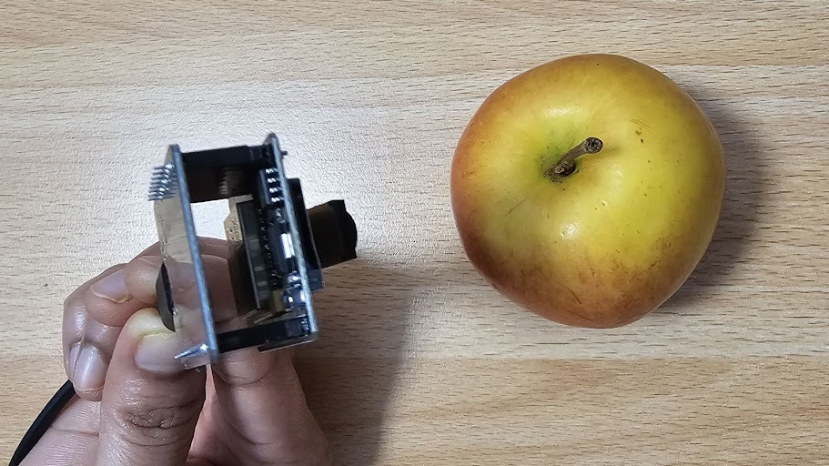
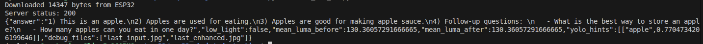

# Real-Time Vision Assistant (ESP32-CAM + YOLO + VLM)

A “Real-Time Vision Assistant” project for scene analysis:
- ESP32-CAM captures a photo (snapshot)
- Python server (FastAPI) analyzes the image using:
  - **YOLO** (object detection hinting / grounding)
  - **Qwen2-VL-2B-Instruct** (vision-language model) to describe the scene.

The ESP32 does **not** run the AI model. The AI runs on your laptop/PC (preferably with an NVIDIA GPU).

---

## What you get

- ESP32 endpoints:
  - `http://<ESP32_IP>/cam-lo.jpg`  (low resolution snapshot)
  - `http://<ESP32_IP>/cam-hi.jpg`  (high resolution snapshot)
- FastAPI endpoints:
  - `GET  /health`
  - `POST /analyze`  (multipart form: `age`, `rotate`, `force_enhance`, and `image` file)
- Client script:
  - `send_cam_hi.py` downloads `cam-hi.jpg` from ESP32 and uploads to the FastAPI server.

---

## Hardware requirements

- ESP32-CAM (Ai-Thinker recommended)
- USB-to-TTL adapter (FTDI/CP2102/CH340)
- Stable 5V power (ESP32-CAM is power-sensitive)
- PC/Laptop running Linux
- NVIDIA GPU recommended (8GB VRAM works, but you must avoid huge models)

---
## Arduino setup (ESP32-CAM)

## Arduino IDE: Install ESP32 boards (Espressif)

1) Open **Arduino IDE → File → Preferences**
2) In **Additional Boards Manager URLs**, add:

**Stable (recommended):**
https://espressif.github.io/arduino-esp32/package_esp32_index.json

(Optional) **Development / bleeding-edge:**
https://espressif.github.io/arduino-esp32/package_esp32_dev_index.json

3) Go to **Tools → Board → Boards Manager**
4) Search **ESP32** and install **“esp32 by Espressif Systems”**
5) Restart Arduino IDE

### 1) Install ESP32 boards in Arduino IDE
Arduino IDE → **Boards Manager** → search for **ESP32 by Espressif Systems** → Install.

### 2) Install required Arduino libraries
This sketch uses:
- `WiFi.h` and `WebServer.h` (come with ESP32 Arduino core)
- `esp32cam` library (provides `#include <esp32cam.h>`)

Arduino IDE → **Library Manager** → search **"esp32cam"** → Install.

### 3) Board settings
Tools → Board:
- Select **AI Thinker ESP32-CAM** (or the exact matching board you have)
- Enable PSRAM if available (recommended)

### 4) Flash `arduino/camera.ino`
Open `camera.ino`, set your Wi-Fi SSID/PASSWORD, press build and upload.

### 5) Verify ESP32 endpoints
Open Serial Monitor at 115200 baud.
You should see something like:
- `http://192.168.x.x/cam-lo.jpg`
- `http://192.168.x.x/cam-hi.jpg`

Test in a browser:
- `http://<ESP32_IP>/cam-hi.jpg`

---

## Python setup (FastAPI server)

### 1) Create a conda environment
```bash
conda create -n yolo python=3.10 -y
conda activate yolo
python -m pip install -U pip
```
###  2) Install dependencies
```bash
python -m pip install \
  ultralytics opencv-python pillow requests numpy \
  fastapi "uvicorn[standard]" python-multipart \
  transformers accelerate qwen-vl-utils
```
  ultralytics will install/require torch. For GPU, you need a CUDA-enabled torch build.

###  3) Put YOLO weights in models/
Option A (recommended):

Create models/ and place yolo11n.pt there.

Then edit server.py:
```bash
YOLO_WEIGHTS = "models/yolo11n.pt" //path of yolo11n. 
```
Option B:

Keep yolo11n.pt in the same folder as server.py.

### 4) Hugging Face cache (avoid “no space left on device”)

The VLM will download ~4–5GB into the Hugging Face cache on first run.

Recommended:
```bash
export HF_HOME=~/hf_cache
export HUGGINGFACE_HUB_CACHE=~/hf_cache/hub
```

### 5) Start the server
```bash
conda activate yolo
python -m uvicorn server:app --host 0.0.0.0 --port 8000
```
### 6) Test the server
```bash
curl http://127.x.x.x:8000/health
```

Sending ESP32 snapshot to the VLM server

Edit send_cam_hi.py:

ESP32_URL = "http://<ESP32_IP>/cam-hi.jpg"

API_URL = "http://127.x.x.x:8000/analyze" (or your LAN IP if calling from another device)

Run:
```bash
conda activate yolo
python send_cam_hi.py
```
You should see JSON output (answer + metadata).

---

### Sample Output
#### Capturing input



#### LLM output


---
### Snapshot vs Stream (important)

cam-hi.jpg / cam-lo.jpg = snapshot

- One JPEG per HTTP request

- Good for VLM (“take a picture and describe it”)

- Lower bandwidth, easier to control latency

/stream (often on port :81) = MJPEG stream

- Continuous frames (video-like)

- Better for real-time detection (YOLO loop)

- Usually more latency due to buffering + network + processing

This repo uses snapshots for the VLM pipeline.

---
### Common troubleshooting
“CUDA out of memory”

- Use smaller VLM (2B is already “small-ish”, but still heavy)

- Close other GPU apps

- Keep YOLO on CPU (already done in server.py)

- Reduce max_new_tokens in server.py

Image rotated

- Change rotate in send_cam_hi.py to 90 or 270.

Dark images

- The server measures brightness and can auto-enhance low light before inference.